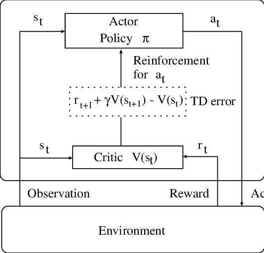
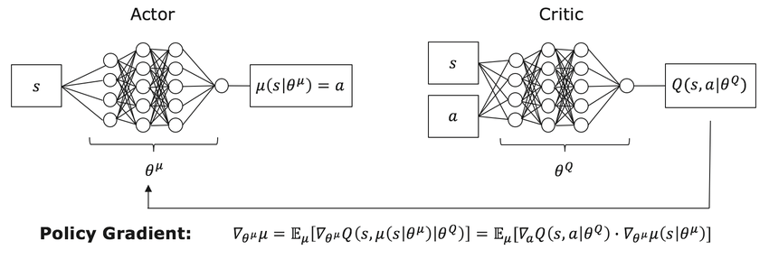
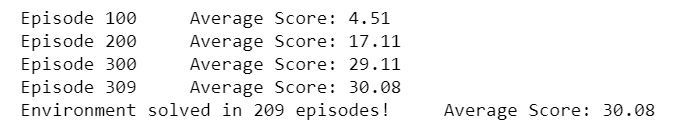
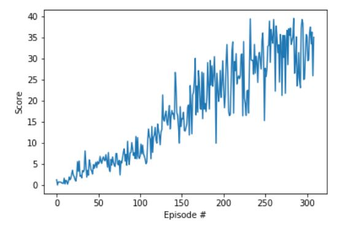

# Continuous Control Project Report 
The objective of this project is to train a reinforcement learning agent to control the motion of a double-joint robot arm 
to reach target locations in a given (virtual) world. The agent is supposed to maintain its position at the target location 
for as many time steps as possible. 

An actor-critc approach is used to learn the optimal policy using deep deterministic policy gradient. 
An actor-critic agent uses function approximation to learn a policy and a value function. So, two neural networks are used, 
one for the actor and the other for the critic. The figure below shows the flow diagram of actor critic methods: 



Figure [reference](https://www.researchgate.net/publication/221485561_Automatic_speech_recognition_based_on_adaptation_and_clustering_using_temporal-difference_learning)
 
 
## Learning Algorithm 
The implementation of DDPG agent is organized in three main files:  
- `Continuous_Control.ipynb` where the environment setting, agent initalization, and traingin management are executed. 
- `ddpg_agent.py` where the learning agent is defined
- `model.py` where the neural network is defined 
 
### Algorithm 
The work in this project is part of the provided framework by Udacity implementing the DDPG algorithm. 
The DDPG is a different type of actor-critic methods. Actually, it could be seen as an approximate DQN since the critic 
in DDPG is used to approximate the maximizer over the Q-values of the next state. DDPG is best classified as a DQN method for continuous action spaces.



Figure [reference](https://www.researchgate.net/publication/322879739_Deep_Reinforcement_Learning_for_Advanced_Energy_Management_of_Hybrid_Electric_Vehicles)

### Nework Architecture 
The designed neural network consists of a 33 dimension input layer, two hidden layers, and an output layer (with 4 outputs)
- First hidden layer: 
  - Input dimension: 33
  - Output dimension: 256 
  - Activation Function: ReLu 
- Second hidden layer: 
  - Input dimension: 256
  - Output dimension: 256 
  - Activation Function: ReLu
- Output layer: 
  - Input dimension: 256
  - Output dimension: 4 
  - Activation Function: tanh (to limit the output between -1 and +1) 

### Hyper parameters 
The algorithm uses the following parameters defined in `ddpg_agent.py` besides those passed to DDPG agent from `Continuous_Control.ipynb`. 
- Learning parameters 
```
BUFFER_SIZE = int(1e6)  # replay buffer size
BATCH_SIZE = 128        # minibatch size
GAMMA = 0.99            # discount factor
TAU = 1e-3              # for soft update of target parameters
LR_ACTOR = 1e-4         # learning rate of the actor 
LR_CRITIC = 2e-4        # learning rate of the critic
WEIGHT_DECAY = 0        # L2 weight decay
```
- Iteration specs   
```
ddpg(n_episodes=1000, max_t=250000, print_every=100)
```

## Results: Average Reward 
The agent is supposed to get a reqard = +30 or greater over 100 successive epsiodes. 
This result is achieved in the first 300 epsiodes at max_t = 250000




## Future work 
The work in this project may be extended to reach a better performance. Some of techniques that may be applied are discussed below: 
1. Sharing Learning: In our implementation we restricted our work to one agent environment where that single agent was supposed to learn the optimal policy alone.
 This may be modified to include all the 20 agents to share their experience. 
2. [A3C algorithm](https://arxiv.org/pdf/1602.01783.pdf): calculates the advantage function and the critic learns to estimate the value function using N-step bootstraping in training. It uses parallel training by creating multiple instances of the environment and agent and running them at the same time. 
This is suitable for the case of using 20 agents to learn the optimal policy and it eliminates the need of the replay buffer. 
3. [D4PG algoirthm](https://openreview.net/forum?id=SyZipzbCb): starts from the DDPG algorithm and includes a number of enhancements. These extensions include a distributional critic update,
the use of distributed parallel actors, N-step returns, and prioritization of the experience replay.
